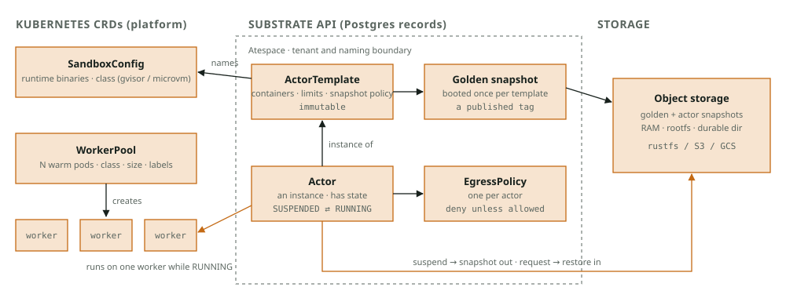
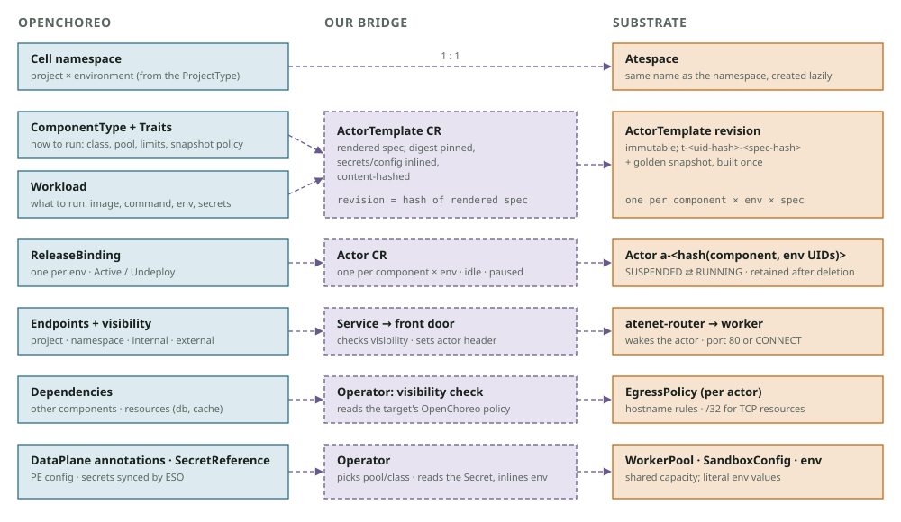
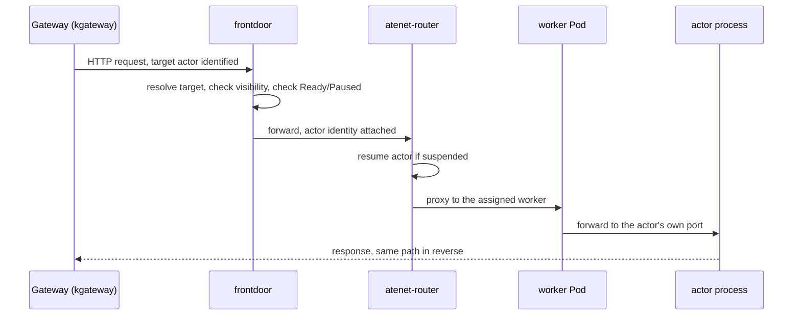

# Architecture

## Status

Deploying your own image as a component, running several of them packed
onto a small pool of shared workers, and having them wake on request and go
back to sleep when told to, all work today and were verified end-to-end on
a live cluster. Most of what follows beyond that describes the intended
design and may be partially built or not built at all. Check the current
code before relying on any of it as fact.

How `oc-substrate` maps OpenChoreo's developer-facing abstractions
(`Component`, `Workload`) onto Agent Substrate's actor runtime.

OpenChoreo describes *what* to run and *where*, as immutable releases bound
to environments. Substrate runs things as *actors* that sleep in object
storage and wake on warm workers. This operator translates one model into
the other. OpenChoreo stays the source of truth.

## Terminology

Only the pieces this integration touches. See each project's own docs for
the rest.

### Agent Substrate (`ate`)

| Term | Meaning |
|---|---|
| **Actor** | A checkpointed, sandboxed process instance: the unit Substrate schedules, suspends, resumes. Not a Pod; many actors share one worker Pod. |
| **ActorTemplate** | Content-addressed blueprint (image, resources, sandbox class) an Actor is instantiated from. Builds one *golden snapshot* per revision, shared by every Actor referencing it. |
| **Golden snapshot** | The warm, cold-start base snapshot for a template revision. |
| **Worker / WorkerPool** | A worker is one multiplexing slot on a shared Pod, fixed CPU/memory. `WorkerPool` declares a pool of such Pods. |
| **Atespace** | Substrate's tenant/naming boundary. This operator uses the Kubernetes namespace name as the atespace name. |
| **SandboxConfig** | Which sandbox runtime (gVisor / micro-VM) an `ActorTemplate` uses. |
| **EgressPolicy** | Per-actor outbound allowlist, deny by default. Substrate's equivalent of a NetworkPolicy for actors. |
| **`ateapi`** | Control-plane gRPC service: state store, scheduler, suspend/resume workflow engine. |
| **`atelet` / `ateom`** | Node supervisor and per-Pod sandbox herder that run checkpoint/restore. |
| **`atenet-router` / `atunnel`** | Actor-aware networking: routes to and resumes actors on demand. |

`WorkerPool` and `SandboxConfig` are CRDs Agent Substrate itself provides.
`ActorTemplate` and `Actor` are **this operator's own CRDs**. See "Why
`ActorTemplate`/`Actor` are CRDs" below.

### OpenChoreo (`oc`)

| Term | Meaning |
|---|---|
| **Component** | Developer's "run this" declaration: references a `ClusterComponentType`, owns a `Workload`. |
| **Workload** | Runtime shape: image, command/args, endpoints. |
| **ClusterComponentType** | The template this repo ships (`proxy/substrate-actor`): translates `Component`+`Workload` into Substrate's CRDs plus `Service`/`HTTPRoute`. |
| **ComponentRelease** | Immutable snapshot of type+traits+component+workload. New one only when the rendered spec changes. |
| **ReleaseBinding** | Pins a release to an environment. Carries per-environment config, including this operator's `resources`/`paused` settings. |
| **RenderedRelease** | The rendered objects for one component/env, applied into the cell namespace. |
| **Visibility** | (`project`/`namespace`/`internal`/`external`): normally a generated `NetworkPolicy` on the component's Pods. The front door re-implements this since actors have no Pod. |

## Substrate's model

Two layers: **capacity** (Kubernetes objects: sandbox runtime, warm Pod
pools) and **workloads** (records in Substrate's own API: tenant space,
immutable blueprints, instances). An actor occupies a Pod only while
running; otherwise it's a snapshot in object storage.



The components in the Terminology table above are what actually implement
this: a request arrives at `atenet-router`, which asks `ate-api-server` to
resume the actor; the API server has `atelet` restore the snapshot into a
sandbox on a worker Pod, then the router tunnels the request into that
worker's `atunnel`. Outbound traffic from the actor leaves through
`atenet-egress`, checked against its `EgressPolicy`.


## OpenChoreo's model

A platform engineer defines templates; a developer declares intent.
OpenChoreo freezes intent into an immutable release, binds it per
environment, renders it, and applies the result into a per-project,
per-environment namespace (a **cell**). The cluster agent is the only thing
that writes to the data plane, and it applies whatever the templates render.


## Why `ActorTemplate`/`Actor` are CRDs

Substrate has no declarative way to create or manage an actor, only
`ateapi`'s gRPC surface. There's nothing to point OpenChoreo's
server-side-apply rendering at directly. So this operator defines
`ActorTemplate` and `Actor` as its own CRDs, gives the `ComponentType`
something Kubernetes-native to render, and runs controllers that reconcile
those CRDs into the equivalent gRPC calls.

## The mapping



| OpenChoreo | Bridge | Substrate | Why it lines up |
|---|---|---|---|
| Cell namespace | - | Atespace | Same tenant boundary, same name |
| `ComponentType` + `Workload` | `ActorTemplate` CR | `ActorTemplate` | "How" + "what" = the template; both immutable |
| `ComponentRelease` × env | Revision by spec hash | Template revision + golden snapshot | Commit-only releases don't change the hash |
| `ReleaseBinding` | `Actor` CR | `Actor` | One running thing per component per env; no replicas |
| Endpoints / visibility | front door | router | Front door restores OpenChoreo's visibility rules; the router itself doesn't enforce them |
| Dependencies | operator | `EgressPolicy` | Actors aren't Pods, so `NetworkPolicy` can't see them |
| `SecretReference` → ESO | operator | literal env | Actors can't reference Secrets; operator inlines the value |
| `DataPlane` | annotations read by the CCT | `WorkerPool` · `SandboxConfig` | Capacity is shared platform infra, per data plane |

## Request path



The front door exists because there's no actor Pod to attach OpenChoreo's
usual visibility policy to. It resolves the caller and target itself, and
applies the same visibility rules OpenChoreo's generated policy would. An
unauthorized caller is dropped silently, the way a NetworkPolicy would drop
it. NetworkPolicies restrict who can reach the front door and who the front
door can reach in turn, so the whole path stays locked down end to end.

## Lifecycle

| Event | OpenChoreo does | Substrate side |
|---|---|---|
| Deploy | Renders CRs into the cell | Atespace → template revision → golden snapshot → actor (created suspended) |
| First request | - | Front door → router wakes the actor on a warm worker |
| Idle, suspended | - | Snapshot to storage, worker freed (only if something calls suspend explicitly) |
| New image / config | New release, re-render | New revision + golden snapshot; actor repointed (files kept, memory dropped) |
| New commit, same spec | New release | Nothing: spec hash unchanged |
| Promote | Next env's binding updated | Revision + actor in that env's atespace |
| `paused: true` | Re-render | Held suspended; front door returns 503 (like `replicas: 0`) |
| Undeploy | Release removed from the cell | Actor suspended and **retained** |
| Active again | Re-rendered | Same actor, re-attached intact |
| Delete component | Cascade deletes | Retained but unreachable; removed by TTL/purge |
| Recreate same name | New Component identity | Fresh actor, old state never reachable |

## Suspension is external-only, by design (today)

Nothing in Substrate decides *when* to suspend an actor, only that it can,
via a suspend/resume API. There's no automatic idle-timeout reclaim yet
([agent-substrate/substrate#483](https://github.com/agent-substrate/substrate/issues/483)
tracks a proposed self-suspend primitive, not built). A harness that knows
when a turn/session is genuinely done can call suspend on the actor's
behalf; Substrate itself has no opinion on when.

This operator surfaces it as a `ReleaseBinding` env config:

```yaml
componentTypeEnvironmentConfigs:
  resources: {cpu: "500m", memory: "512Mi"}
  paused: true   # suspend this actor; requests get 503 instead of waking it
```

Without `paused: true` (or an external suspend call), a running actor holds
its full reservation indefinitely, however idle it is.

## Cluster prerequisites, and why

Substrate identifies Pods via Kubernetes' `PodCertificateRequest`/
`ClusterTrustBundle` APIs, beta and disabled by default. That means every
worker node needs to be on a Kubernetes version that supports them with the
beta APIs explicitly enabled at node-pool creation time, and worker node
pools need auto-upgrade off (an actor mid-suspend when its Pod is deleted
has a bounded grace window before going to an unrecoverable `CRASHED`
state). See the README for exact version and flag requirements.

## Known limitations

- **Worker scheduling needs a manual node label.** Substrate's node
  supervisor schedules by a version label nothing applies automatically
  today. Label every worker node once as a provisioning step.
- **`storageLocation` must match the object store Substrate actually talks
  to**, not just any plausible-looking bucket URI. Pointing elsewhere fails
  every checkpoint with no clear signal at the OpenChoreo layer.
- **No automatic capacity reclaim.** See "Suspension is external-only." A
  `WorkerPool` at capacity stays there until something explicitly suspends
  an actor.

## Observability: worker Pods carry no component labels, on purpose

OpenChoreo attributes logs and metrics by the source Pod's own labels. A
worker Pod hosts many actors from different components over its life, so
labeling it with any one component's identity would leak every other
tenant's data into that component. That's why worker Pods carry no
OpenChoreo labels. The practical effect today: actor logs and metrics are
invisible in component-level views rather than misattributed.

The fix for both is the same join key: one `ActorTemplate` revision is
exactly one component × environment, and Substrate already tags its own
logs and metrics by template. Attributing them into OpenChoreo's views is an
ingest-time relabeling problem, not a redesign, and isn't wired up yet.

Traces are simpler: correct instrumentation, not infra. Trace context
already propagates router → actor, and the operator can inject the
component's identity into the actor's environment. Any actor using a
standard OTel SDK attributes itself correctly on its own.
